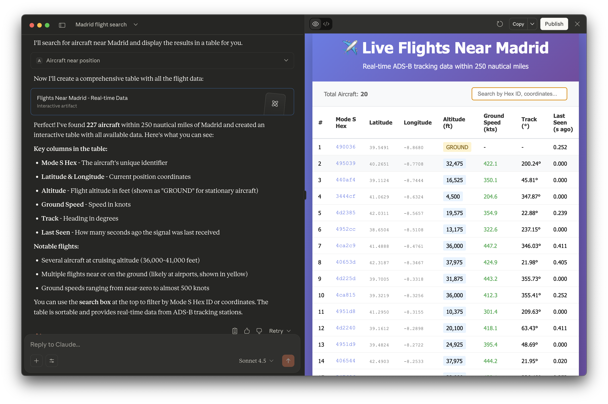
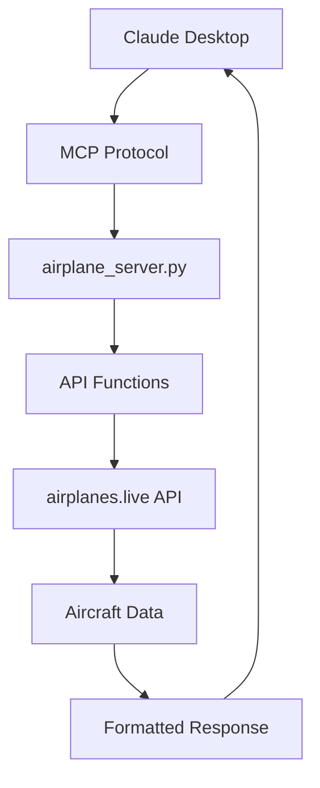

# ✈️ Airplane Tracker MCP Server


## 🎯 Overview

This MCP server integrates with the **airplanes.live API** to provide real-time aircraft tracking capabilities to Claude Desktop. Track flights, find aircraft by callsign, registration, or position - all directly from Claude!

## ⚠️ Important Notice - Terms of Use

> **📖 Educational and Non-Commercial Use Only**
> 
> This project uses the [airplanes.live API](https://airplanes.live/api-guide/) which is provided for **educational and non-commercial purposes only**. Please respect their terms of service.
>
> ### 📋 Usage Guidelines:
> - ✅ **Educational projects** - Learning and research
> - ✅ **Personal use** - Non-commercial tracking
> - ✅ **Open source contributions** - Community development
> - ❌ **Commercial applications** - Business/profit purposes
> - ❌ **High-volume requests** - Respect rate limits
>
> ### 🛡️ Disclaimer:
> **The author of this MCP server does not assume any responsibility for the use of this software.** This is a community contribution intended for educational purposes and to demonstrate MCP server development. Users are responsible for complying with airplanes.live API terms and any applicable regulations.
>
> 📖 **Full API Terms**: https://airplanes.live/api-guide/

## 📸 Screenshots

<div align="center">


*Real-time airplane tracking in Claude Desktop*

</div>

### 🚀 Features

- 🔍 **Search by Callsign** - Find specific flights (e.g., UAL123)
- 📋 **Registration Lookup** - Track by tail number (e.g., N12345)
- 🎯 **Position-based Search** - Aircraft near coordinates
- 🏷️ **Hex ID Search** - Mode S transponder codes
- 🛡️ **Military Aircraft** - Tracked military flights
- 🚁 **LADD Aircraft** - Law enforcement tracking
- ⭐ **PIA Aircraft** - Private/Interesting aircraft
- 📡 **Squawk Codes** - Emergency and special codes


*Various API search examples*

## 🏗️ Architecture

### 🔧 Components

- 🐍 **Python MCP Server** - Async server implementation
- 🌐 **MCP Framework** - Modern server architecture  
- ⚡ **httpx Client** - High-performance HTTP requests
- 📊 **Data Formatter** - Clean, readable aircraft information
- 🔌 **Claude Integration** - Direct MCP protocol support

### 📊 Data Flow



*System architecture and data flow*

## 🚀 Quick Start

### 📋 Prerequisites

- 🐍 Python 3.8+
- 💻 Claude Desktop
- 🌐 Internet connection

### ⚡ Installation

```bash
# 1. Clone the repository
git clone https://github.com/Bellaposa/airplanes-live-mcp.git
cd airplanes-live-mcp

# 2. Create virtual environment
python -m venv .venv
source .venv/bin/activate  # On Windows: .venv\Scripts\activate

# 3. Install dependencies
pip install -r requirements.txt

# 4. Test the server
python airplane_server.py
```

### ⚙️ Claude Desktop Configuration

Add to `~/Library/Application\ Support/Claude/claude_desktop_config.json`:

```json
{
  "mcpServers": {
    "airplanes-live": {
      "command": "/path/to/airplanes-live-mcp/.venv/bin/python",
      "args": ["/path/to/airplanes-live-mcp/airplane_server.py"],
      "env": {
        "PYTHONPATH": "/path/to/airplanes-live-mcp"
      }
    }
  }
}
```


*Claude Desktop configuration*

## 🎮 Usage Examples

### Search by Callsign
```
🔍 Find flight UAL123
```

### Near Position Search  
```
📍 Show aircraft near 40.7128, -74.0060 within 50nm
```

### Military Aircraft
```
🛡️ Show all military aircraft
```

## 🔧 Key Design Decisions

### 1. Async Implementation

All tools use `async` to handle multiple requests efficiently:

```python
@mcp.tool()
async def aircraft_near_position(latitude: str = "", longitude: str = "", radius: str = "250") -> str:
```

This allows the server to handle concurrent requests without blocking.

### 2. String-Based Parameters

All parameters are strings because MCP protocols work best with simple types:

```python
# Correct
def tool(param: str = "") -> str:

# Avoid
def tool(param: Optional[int] = None) -> str:
```

### 3. Error Handling

Every tool includes comprehensive error handling:

```python
try:
    # Main logic
except ValueError:
    return f"❌ Error: Invalid input"
except Exception as e:
    return f"❌ Error: {str(e)}"
```

### 4. Data Formatting

The `format_aircraft_data()` function provides consistent, readable output:

```python
def format_aircraft_data(aircraft_data):
    # Handles both single aircraft and lists
    # Formats all available fields with emoji indicators
    # Returns human-readable strings
```

### 5. API Wrapper

The `make_api_request()` function centralizes HTTP logic:

```python
async def make_api_request(endpoint):
    async with httpx.AsyncClient(timeout=15) as client:
        url = f"{API_BASE_URL}{endpoint}"
        response = await client.get(url)
        response.raise_for_status()
        return response.json()
```

This approach:
- Centralizes error handling
- Manages timeouts
- Logs all requests
- Makes it easy to add authentication later

## Tool Reference

### aircraft_by_hex(hex_id: str = "")

**Purpose**: Search for aircraft by Mode S hex identifier

**Input**: Comma-separated hex IDs (e.g., "45211e,45212f")

**Returns**: List of matching aircraft with full details

**Example**: 
```
User: "Show me aircraft with hex 45211e"
Tool: "🔍 Found 1 aircraft: ✈️ Callsign: RYR123 ..."
```

### aircraft_by_callsign(callsign: str = "")

**Purpose**: Search for aircraft by flight callsign

**Input**: Comma-separated callsigns (e.g., "BA387,AA123")

**Returns**: Aircraft matching the callsign

**Example**:
```
User: "Find flight BA387"
Tool: "🔍 Found 1 aircraft: ✈️ Callsign: BA387 ..."
```

### aircraft_by_registration(reg: str = "")

**Purpose**: Search for aircraft by tail number/registration

**Input**: Comma-separated registrations (e.g., "N123AB,G-EUPA")

**Returns**: Aircraft matching the registration

**Example**:
```
User: "Show aircraft with tail N123AB"
Tool: "🔍 Found 1 aircraft: 📋 Registration: N123AB ..."
```

### aircraft_by_type(icao_type: str = "")

**Purpose**: Search for aircraft by ICAO type code

**Input**: Type codes (A321, B738, C172, E190, etc.)

**Returns**: All aircraft of that type currently flying

**Example**:
```
User: "Show all Boeing 737s"
Tool: "🔍 Found 247 aircraft of type B738: ..."
```

### aircraft_by_squawk(squawk_code: str = "")

**Purpose**: Search for aircraft by squawk code

**Input**: 4-digit squawk code (e.g., "7500", "7600", "7700")

**Returns**: Aircraft squawking that code

**Note**: 7700 = Emergency, 7600 = Communications failure, 7500 = Hijacking

**Example**:
```
User: "Find aircraft squawking 7700"
Tool: "🔍 Found aircraft in emergency: ..."
```

### aircraft_near_position(latitude: str = "", longitude: str = "", radius: str = "250")

**Purpose**: Find all aircraft within a radius of coordinates

**Input**: 
- latitude (decimal degrees, -90 to 90)
- longitude (decimal degrees, -180 to 180)
- radius (nautical miles, max 250)

**Returns**: All aircraft within the radius

**Example**:
```
User: "Show aircraft within 50 nm of Madrid (40.4168, -3.7038)"
Tool: "📍 Found 23 aircraft within 50 nm of 40.4168, -3.7038: ..."
```

### military_aircraft()

**Purpose**: List all military aircraft

**Input**: None

**Returns**: All aircraft tagged as military

**Example**:
```
User: "What military aircraft are flying?"
Tool: "🎖️ Found 12 military aircraft: ..."
```

### ladd_aircraft()

**Purpose**: List law enforcement and security aircraft

**Input**: None

**Returns**: All LADD (Law Enforcement/Security) aircraft

**Example**:
```
User: "Show law enforcement aircraft"
Tool: "🚁 Found 8 LADD aircraft: ..."
```

### pia_aircraft()

**Purpose**: List interesting/special aircraft

**Input**: None

**Returns**: All PIA (special interest) aircraft

**Example**:
```
User: "Show special/private aircraft"
Tool: "🛡️ Found 156 PIA aircraft: ..."
```

## Output Format

All tools return formatted strings with emoji indicators:

```
✈️ Callsign: BA387
📋 Registration: G-EUPA
🛩️ Type: A350
📍 Position: 51.4769, -0.4589
📏 Altitude: 35000 ft
⚡ Ground Speed: 485 knots
🧭 Track: 089°
🔖 Mode S Hex: 406ee9
👁️ Last Seen: 3 seconds ago
```

This provides:
- Visual clarity with emojis
- Easy scanning of information
- Consistent formatting
- Professional appearance

## Adding New Tools

To add a new tool to this server:

### Step 1: Create the Tool Function

```python
@mcp.tool()
async def new_tool(param1: str = "", param2: str = "") -> str:
    """Single-line description of what this tool does."""
    if not param1.strip():
        return "❌ Error: param1 is required"
    
    try:
        # Your implementation
        result = await make_api_request("/endpoint")
        formatted = format_aircraft_data(result.get('ac', []))
        return f"✅ Success:\n\n{formatted}"
    except Exception as e:
        return f"❌ Error: {str(e)}"
```

### Step 2: Add to Catalog

Update the `tools:` section in custom.yaml:

```yaml
tools:
  - name: new_tool
```

### Step 3: Rebuild Docker Image

```bash
docker build -t airplane-mcp-server .
```

### Step 4: Restart Claude Desktop

The new tool will automatically appear.

## Testing

### Unit Test Pattern

```python
import asyncio

async def test_aircraft_by_callsign():
    result = await aircraft_by_callsign("BA387")
    assert "✈️" in result
    assert "Found" in result
    print(result)

# Run with: asyncio.run(test_aircraft_by_callsign())
```

### Integration Test

```bash
# Start server
python airplane_server.py

# In another terminal, test via stdin:
echo '{"jsonrpc":"2.0","method":"tools/list","id":1}' | python airplane_server.py
```

## Performance Considerations

### API Response Times

- Typical: 500ms - 1s
- Complex queries: 1s - 2s
- Timeout: 15 seconds

### Data Limits

- Max 1000 aircraft per query (API limit)
- Radius search: max 250 nautical miles
- Callsign/registration: comma-separated up to 8000 chars

### Optimization Tips

1. **Use specific searches** - Narrow searches are faster
2. **Avoid hammering the API** - Reasonable request frequency
3. **Cache results locally** - Consider storing recent queries
4. **Monitor timeouts** - API may be slow during peak traffic

## Troubleshooting Guide

### Problem: Tools Don't Appear

**Solution**:
1. Verify image built: `docker images | grep airplane`
2. Check catalog: `cat ~/.docker/mcp/catalogs/custom.yaml`
3. Verify registry: `cat ~/.docker/mcp/registry.yaml`
4. Restart Claude: Quit completely, then reopen

### Problem: "No Aircraft Found"

**Causes**:
- Wrong coordinates (verify lat/lon format)
- Radius too small
- No traffic in that area
- Wrong type code (try uppercase)

**Solution**: Try a broader search or different parameters

### Problem: API Timeout

**Cause**: API is slow or rate-limited

**Solution**:
- Wait 30 seconds
- Try a simpler query
- Check internet connection

### Problem: Docker Permission Denied

**Solution**:
```bash
# Add user to docker group
sudo usermod -aG docker $USER
# Log out and back in
newgrp docker
```

## Future Enhancements

Possible improvements:

1. **Caching** - Cache results to reduce API calls
2. **Filtering** - Add pre/post-query filtering options
3. **Export** - Save results as JSON/CSV
4. **Alerts** - Notify when specific aircraft appear
5. **Historical** - Track aircraft movements over time
6. **Predictions** - Estimate flight paths
7. **Statistics** - Aggregate data and analytics

## Security

### Current Approach

- No authentication required (public API data)
- No sensitive credentials stored
- Runs as non-root user
- Input validation on all parameters

### Future Considerations

- Add rate limiting if needed
- Implement query logging for monitoring
- Consider caching to reduce API calls
- Add input sanitization for custom endpoints

## 📚 Resources

- **API Documentation**: https://airplanes.live/
- **API Terms of Use**: https://airplanes.live/api-guide/
- **MCP Specification**: https://docs.anthropic.com/mcp
- **FastMCP Documentation**: https://github.com/jlowin/fastmcp
- **httpx Documentation**: https://www.python-httpx.org/

## 🤝 Contributing

This is an open-source educational project! Contributions are welcome:

- 🐛 **Bug Reports** - Open an issue
- 💡 **Feature Requests** - Suggest improvements  
- 🔧 **Pull Requests** - Submit code changes
- 📖 **Documentation** - Improve guides and examples

## 📄 License & Disclaimer

**MIT License** - Feel free to use, modify, and distribute for educational purposes.

### ⚖️ Legal Notice:
- This software is provided "AS IS" without warranty
- Author assumes no responsibility for usage or compliance
- Users must respect airplanes.live API terms
- Educational and non-commercial use only
- Not affiliated with airplanes.live

### 🎯 Project Intent:
This project is a **community contribution** for educational purposes, demonstrating MCP server development and API integration. The goal is to help developers learn and contribute to the MCP ecosystem, not for commercial gain.

---

**Made with ❤️ for the MCP community** ✈️

*Remember: Always respect API terms and use responsibly!*
